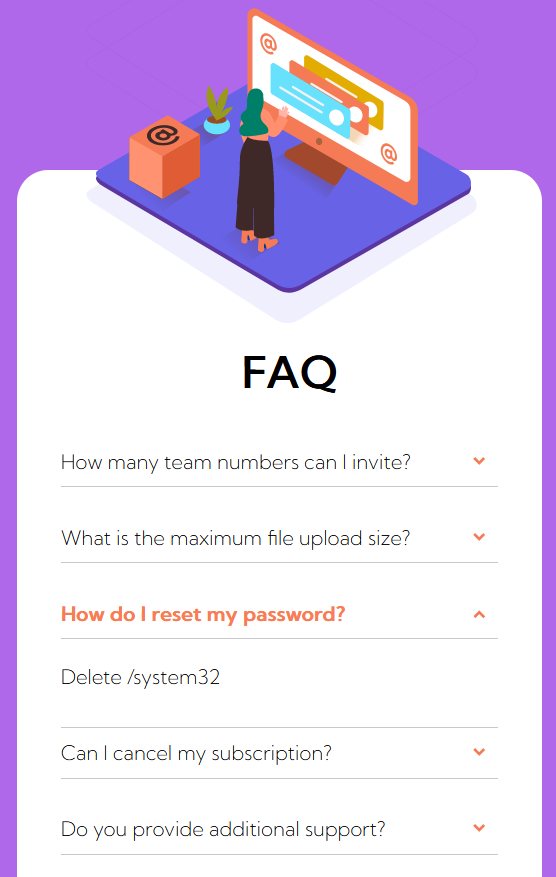

<h1 align="center">Faq Card in HTML CSS JAVASCRIPT</h1>

<h2 align="center">Interaction</h2>

<h3>Here is our card, we can click on one of the button and an other block appear !</h3>

#### The underside of the decor

This image doesn't seem like it would be very difficult to incorporate but it is! First of all you have to implement the background and not let it leave the “faq card”.
For this, we add an overflow:hidden; at faq card. After that we add the woman with a position: absolute; . Subsequently we add our cube but our faq is hidden so our cube will be hidden so we surround (in the HTML) our cube with a div in relative position.

<h1 align="center">The Responsive</h1> 

