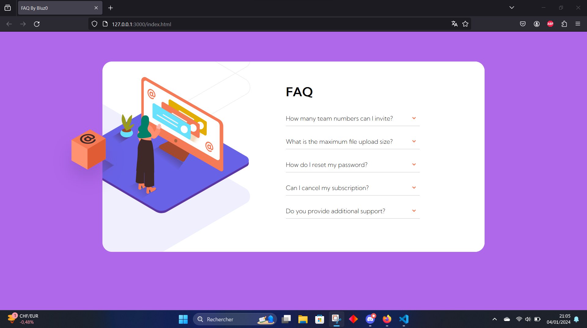
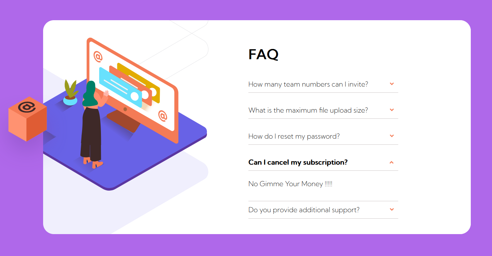

<h1 align="center">Faq Card in HTML CSS JAVASCRIPT</h1>

### Interaction

<h3>Here is our card, we can click on one of the button and an other block appear !
GIVE ME YOUR MONEY, CASH, DOLLAR, ARGENT , FLOUSSE...etc $$$
</h3>

